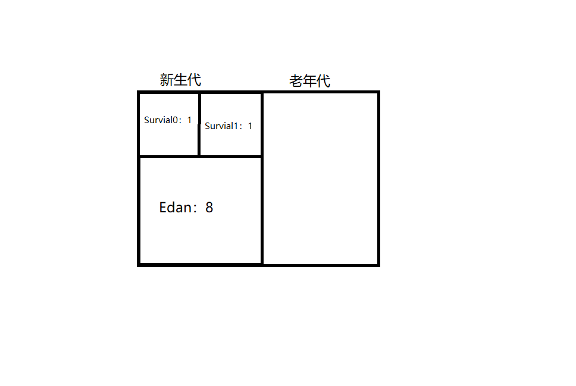
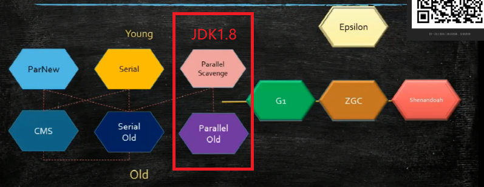
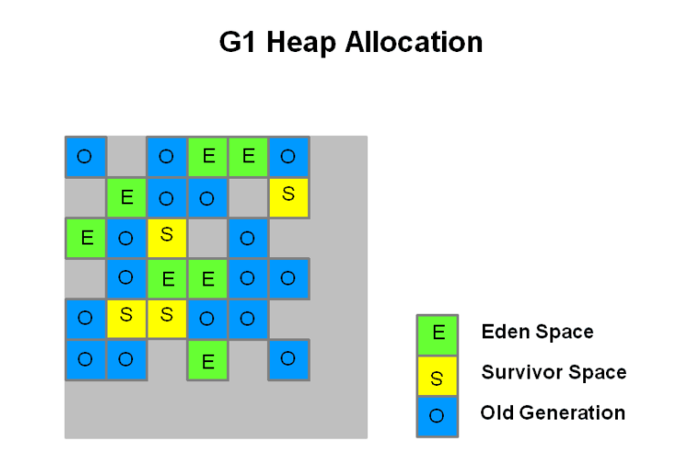

## 2020届秋招面试题总结——JVM篇

**1、什么情况下会发生栈内存溢出。**

在HotSpot虚拟机中是不区分虚拟机栈和本地方法栈，栈是线程私有的，它的生命周期与线程相同，每个方法在执行的时候都会创建一个栈帧，用来存储局部变量表、操作数栈、动态链接、方法出口等信息。每一个方法从调用直至执行完成的过程，就对应着一个栈桢在虚拟机栈中入栈到出栈的过程。本地方法栈与虚拟机栈相似，区别不过是虚拟机栈为虚拟机执行Java方法（也就是字节码）服务，而本地方法栈则为虚拟机使用到的Native方法服务。

栈内存溢出是指线程请求的栈深度大于虚拟机所允许的最大深度，则将抛出StackOverflowError异常（StackOverflowError 不属于 OOM 异常）。最有可能的原因就是方法递归产生的这种结果。

另一个可能是引用了大的变量，在拓展栈时无法申请到足够的内存空间，则抛出OutOfMemoryError异常（这个属于内存溢出）。

**内存溢出和内存泄漏的区别
内存溢出 out of memory，是指程序在申请内存时，没有足够的内存空间供其使用，出现out of memory；比如申请了一个integer,但给它存了long才能存下的数，那就是内存溢出。

内存泄露 memory leak，是指程序在申请内存后，无法释放已申请的内存空间，一次内存泄露危害可以忽略，但内存泄露堆积后果很严重，无论多少内存,迟早会被占光。

memory leak会最终会导致out of memory！

**类加载器**
类加载器 就是根据指定全限定名称将class文件加载到JVM内存，转为Class对象。
启动类加载器（Bootstrap ClassLoader）：由C++语言实现（针对HotSpot）,负责将存放在<JAVA_HOME>\lib目录或-Xbootclasspath参数指定的路径中的类库加载到内存中。
其他类加载器：由Java语言实现，继承自抽象类ClassLoader。如：
	扩展类加载器（Extension ClassLoader）：负责加载<JAVA_HOME>\lib\ext目录或java.ext.dirs系统变量指定的路径中的所有类库。
	应用程序类加载器（Application ClassLoader）。负责加载用户类路径（classpath）上的指定类库，我们可以直接使用这个类加载器。一般情况，如果我们没有自定义类加载器默认就是用这个加载器。

**双亲委派模型
如果一个类加载器收到类加载的请求，它首先不会自己去尝试加载这个类，而是把这个请求委派给父类加载器完成。
每个类加载器都是如此，只有当父加载器在自己的搜索范围内找不到指定的类时（即ClassNotFoundException），子加载器才会尝试自己去加载。

**为什么需要双亲委派模型**
如果没有双亲委派，那么用户是不是可以自己定义一个java.lang.Object的同名类，java.lang.String的同名类，并把它放到ClassPath中,那么类之间的比较结果及类的唯一性将无法保证，因此，为什么需要双亲委派模型？防止内存中出现多份同样的字节码

**打破双亲委派模型**
打破双亲委派机制则不仅要继承ClassLoader类，还要重写loadClass和findClass方法。

**2、JVM的内存结构，Eden和Survivor比例。**

Java虚拟机在执行Java程序的过程中把它所管理的内存划分为若干个不同的数据区域，这些区域都有各自的用途。

- 程序计数器。每个线程都有一个程序计算器，就是一个指针，指向方法区中的方法字节码（下一个将要执行的指令代码），由执行引擎读取下一条指令，是一个非常小的内存空间，几乎可以忽略不记。也是唯一一个不会发生内存溢出的区域。
- Java虚拟机栈。
	编译器可知的各种基本数据类型(boolean、byte、char、short、int、float、long、double)、对象引用(引用指针，并非对象本身)
　　栈是java 方法执行的内存模型：
　　每个方法被执行的时候 都会创建一个“栈帧”用于存储局部变量表(包括参数)、操作栈、方法出口等信息。
　　每个方法被调用到执行完的过程，就对应着一个栈帧在虚拟机栈中从入栈到出栈的过程。
- 本地方法栈。与虚拟机栈相似，区别不过是虚拟机栈为虚拟机执行Java方法（也就是字节码）服务，而本地方法栈则为虚拟机使用到的Native方法服务。
- Java堆。
  - 
	所有的对象实例以及数组都要在堆上分配，此内存区域的唯一目的就是存放对象实例
　　堆是Java 虚拟机所管理的内存中最大的一块。Java 堆是被所有线程共享的一块内存区域，在虚拟机启动时创建
　　堆是理解Java GC机制最重要的区域，没有之一
　　结构：新生代（Eden区+2个Survivor区）  老年代   永久代（HotSpot有）
    新生代的对象会很快死掉，大约有15%会存活，采用复制算法进行垃圾回收
　　新生代：新创建的对象——>Eden区 
　　GC之后，存活的对象由Eden区、Survivor1进入Survivor0 ，空出Survivor1和Eden 
　　再次GC，存活的对象由Survivor0、Eden进入Survivor1，空出Eden和Survivor0

　　老年代：对象如果在新生代存活了足够长的时间而没有被清理掉（即在几次Young GC（15次）后存活了下来），则会被复制到老年代.老年代使用标记-清除或者标记-整理算法进行垃圾回收
　　如果新创建对象比较大（比如长字符串或大数组），新生代空间不足，则大对象会直接分配到老年代上（大对象可能触发提前GC，应少用，更应避免使用短命的大对象）
　　老年代的空间一般比新生代大，能存放更多的对象，在老年代上发生的GC次数也比年轻代少
- 方法区。所有线程共享区域，用于存储虚拟机加载的：静态变量+常量+类信息+运行时常量池 （类信息：类的版本、字段、方法、接口、构造函数等描述信息 ）
- 运行时常量池。是方法区的一部分，用于存放编译器生成的各种字面量和符号引用。
- 直接内存。直接内存并不是JVM管理的内存，可以这样理解，直接内存，就是JVM以外的机器内存，比如，你有4G的内存，JVM占用了1G，则其余的3G就是直接内存

JVM中要对堆进行分代，分代的理由是优化GC性能，很多对象都是朝生夕死的，如果分代的话，我们把新创建的对象放到某一地方，当GC的时候先把这块存“朝生夕死”对象的区域进行回收，这样就会腾出很大的空间出来。
HotSpot JVM把新生代分为了三部分：1个Eden区和2个Survivor区（分别叫from和to）。默认比例为8：1。一般情况下，新创建的对象都会被分配到Eden区(一些大对象特殊处理),这些对象经过第一次Minor GC后，如果仍然存活，将会被移到Survivor区。
对象在Survivor区中每熬过一次Minor GC，年龄就会增加1岁，当它的年龄增加到一定程度时，就会被移动到年老代中。
因为年轻代中的对象基本都是朝生夕死的(80%以上)，所以在年轻代的垃圾回收算法使用的是复制算法，复制算法的基本思想就是将内存分为两块，每次只用其中一块，当这一块内存用完，就将还活着的对象复制到另外一块上面。复制算法不会产生内存碎片。

**3、JVM内存为什么要分成新生代、老年代和持久代。**

堆内存是虚拟机管理的内存中最大的一块，也是垃圾回收最频繁的一块区域，我们程序所有的对象实例都存放在堆内存中。给堆内存分代是为了提高对象内存分配和垃圾回收的效率。试想一下，如果堆内存没有区域划分，所有的新创建的对象和生命周期很长的对象放在一起，随着程序的执行，堆内存需要频繁进行垃圾收集，而每次回收都要遍历所有的对象，遍历这些对象所花费的时间代价是巨大的，会严重影响我们的GC效率，这简直太可怕了。
有了内存分代，情况就不同了，新创建的对象会在新生代中分配内存，经过多次回收仍然存活下来的对象存放在老年代中，静态属性、类信息等存放在永久代中，新生代中的对象存活时间短，只需要在新生代区域中频繁进行GC，老年代中对象生命周期长，内存回收的频率相对较低，不需要频繁进行回收，永久代中回收效果太差，一般不进行垃圾回收，还可以根据不同年代的特点采用合适的垃圾收集算法。分代收集大大提升了收集效率，这些都是内存分代带来的好处。
HotSpot将新生代划分为三块，一块较大的Eden空间和两块较小的Survivor空间，默认比例为8：1：1。划分的目的是因为HotSpot采用复制算法来回收新生代，设置这个比例是为了充分利用内存空间，减少浪费。新生成的对象在Eden区分配（大对象除外，大对象直接进入老年代），当Eden区没有足够的空间进行分配时，虚拟机将发起一次Minor GC。

**新生代中为什么要分Eden和Survivor**
如果没有Survivor，Eden区每进行一次Minor GC，存活的对象就会被送到老年代。老年代很快被填满，触发Major GC.老年代的内存空间远大于新生代，进行一次Full GC消耗的时间比Minor GC长得多,所以需要分为Eden和Survivor。
Survivor的存在意义，就是减少被送到老年代的对象，进而减少Full GC的发生，Survivor的预筛选保证，只有经历16次Minor GC还能在新生代中存活的对象，才会被送到老年代。
设置两个Survivor区最大的好处就是解决了碎片化，刚刚新建的对象在Eden中，经历一次Minor GC，Eden中的存活对象就会被移动到第一块survivor space S0，Eden被清空；等Eden区再满了，就再触发一次Minor GC，Eden和S0中的存活对象又会被复制送入第二块survivor space S1（这个过程非常重要，因为这种复制算法保证了S1中来自S0和Eden两部分的存活对象占用连续的内存空间，避免了碎片化的发生）

**Java何时进行垃圾回收**

JAVA 垃圾回收 分三个区域：
1、新生代：
1）.Eden（伊甸园）区是新对象分配内存的地方，由于堆是所有线程共享的，因此在堆上分配内存需要加锁。而Sun JDK为提升效率，会为每个新建的线程在Eden上分配一块独立的空间由该线程独享，这块空间称为TLAB（Thread Local Allocation Buffer）。
    在TLAB上分配内存不需要加锁，因此JVM在给线程中的对象分配内存时会尽量在TLAB上分配。如果对象过大或TLAB用完，则仍然在堆上进行分配。如果Eden区内存也用完了，则会进行一次Minor GC（young GC）。
2）.Survival from to
    Survival区有两块，一块称为from区，另一块为to区，这两个区是相对的，在发生一次Minor GC后，from区就会和to区互换。在发生Minor GC时，Eden区和Survivalfrom区会把一些仍然存活的对象复制进Survival to区，并清除内存。
Survival to区会把一些存活得足够旧的对象移至年老代。
2、老年代：
    年老代里存放的都是存活时间较久的，大小较大的对象，因此年老代使用标记整理算法。当年老代容量满的时候，会触发一次Major GC（full GC），回收年老代和年轻代中不再被使用的对象资源。
3、 永久代
    在JDK8之前的HotSpot虚拟机中，类的这些“永久的”数据存放在一个叫做永久代的区域。永久代一段连续的内存空间，我们在JVM启动之前可以通过设置-XX:MaxPermSize的值来控制永久代的大小，32位机器默认的永久代的大小为64M，64位的机器则为85M。
永久代的垃圾回收和老年代的垃圾回收是绑定的，一旦其中一个区域被占满，这两个区都要进行垃圾回收。但是有一个明显的问题，由于我们可以通过‑XX:MaxPermSize 设置永久代的大小，一旦类的元数据超过了设定的大小，程序就会耗尽内存，并出现
内存溢出错误OutOfMemoryError(OOM)。这里值得注意的是，JDK8移除了永久代。

**4、JVM中一次完整的GC流程是什么样子的，对象如何晋升到老年代，说说你知道的几种主要的JVM参数。**

	GC开始时，对象只会存在于Eden区和From Survivor区，To Survivor区是空的（作为保留区域）。GC进行时，Eden区中所有存活的对象都会被复制到To Survivor区，而在From Survivor区中，仍存活的对象会根据它们的年龄值决定去向，
年龄值达到年龄阀值（默认为15，新生代中的对象每熬过一轮垃圾回收，年龄值就加1，GC分代年龄存储在对象的header中）的对象会被移到老年代中，没有达到阀值的对象会被复制到To Survivor区。接着清空Eden区和From Survivor区，
新生代中存活的对象都在To Survivor区。接着， From Survivor区和To Survivor区会交换它们的角色，也就是新的To Survivor区就是上次GC清空的From Survivor区，新的From Survivor区就是上次GC的To Survivor区，总之，
不管怎样都会保证To Survivor区在一轮GC后是空的。GC时当To Survivor区没有足够的空间存放上一次新生代收集下来的存活对象时，需要依赖老年代进行分配担保，将这些对象存放在老年代中。

对象晋升老年代有三种可能：

- 当对象达到成年，经历过15次GC（默认是15，可配置），对象就晋升到老年代了。
- 大的对象会直接在老年代创建。
- 新生代的Survivor空间内存不足时，对象可能直接晋升到老年代。

jvm参数：

-  -Xms：初始堆大小 
- -Xmx：堆最大内存 
- -Xss：栈内存 
- -XX:PermSize 初始永久代内存 
- -XX:MaxPermSize 最大永久带内存

**5、你知道哪几种垃圾收集器，各自的优缺点，重点讲下cms和G1，包括原理，流程，优缺点。**

常见的垃圾收集器主要有以下四种：

- 串行收集器（Serial、ParNew收集器）：简单高效，但它在进行垃圾收集时，必须暂停其他所有的工作线程，直到它收集结束，中间停顿时间长。
- 并行收集器（Parallel Scavenge收集器）：吞吐量优先，主要关注点在于精确控制吞吐量，即减少GC停顿时间，但收集次数变多。
- CMS：以获取最短回收停顿时间为目标的收集器，并发**标记-清除**，主要步骤有，初始标记，并发标记，重新标记和并发清除。其中，整个过程耗时最长的并发标记和并发清除过程收集器线程都可以和用户线程一起工作，
	   CMS收集器的内存回收过程始于用户线程一起并发执行的。重新标记是为了修正并发标记期间因用户程序继续运作而导致标记产生变动的那一部分对象的标记记录。但缺点有，CMS收集器对CPU资源非常敏感，并且无法处理浮动垃圾。
- G1：可预测停顿的收集器，并发**标记-整理**，主要步骤分为，初始标记，并发标记，最终标记和筛选回收。G1把内存“化整为零”，并且可以分代收集。注意：CMS是清除，所以会存在很多的内存碎片。G1是整理，所以碎片空间较小。

**6、垃圾回收算法的实现原理。**

垃圾收集算法主要分为以下三种：

- 标记-清除算法：首先标记出所有需要回收的对象，在标记完成后统一回收所有被标记的对象。
- 复制算法：将可用内存按容量分为两块（Eden和Survivor空间），每次只使用一块，当这一块内存用完后，就将还活着的对象复制到另外一块上面，然后再把已使用过内存空间一次清理掉。
  - 缺点：内存空间变为原来的一半
  - 优点：效率比较高，没有碎片
- 标记-整理算法：标记过程与“标记-清除”算法一样，但后续步骤不是直接对可回收对象进行清理，而是让所有存活的对象都向一端移动，然后直接清理掉边界外的内存。
  - 移动过程非常耗时

需要注意的是，“标记-清除”算法存在**两个不足**：

- 一个是**效率问题**，标记和清除两个过程的效率都不高；
- 另一个是**空间问题**，标记清除之后会产生大量不连续的内存碎片，空间碎片太多可能会导致以后在程序运行过程中需要分配较大对象时，无法找到足够的连续内存而不得不提前触发另一个垃圾收集动作。作为对比，复制算法每次都是对整个半区进行内存回收，内存分配时也就不用考虑内存碎片等复杂情况，只要移动堆顶指针，按顺序分配内存即可，实现简单，运行高效。

**7、当出现了内存溢出，怎么排错。**

- 首先控制台查看错误日志。
- 然后使用jdk自带的VisualVM来查看系统的堆栈日志（也可以用jmap查看堆转储快照）。
- 定位出内存溢出的空间：堆，栈还是永久代（jdk8后没有永久代的溢出了）。
- 如果是堆内存溢出，看是否创建了超大的对象。
- 如果是栈内存溢出，看是否创建了超大的对象，或者产生了死循环，或者递归调用。

**8、JVM内存模型的相关知识了解多少，比如重排序，内存屏障，happen-before，主内存，工作内存等。**

重排序是指编译器和处理器为了优化程序性能而对指令序列进行重新排序的一种手段。

内存屏障是一种CPU指令，用于控制特定条件下的重排序和内存可见性问题。Java编译器也会根据内存屏障的规则禁止重排序。

happen-before用来阐述操作之间的内存可见性。在JMM中，如果一个操作执行的结果需要对另一个操作可见，那么这两个操作之间必须要存在happens-before关系。具体原则如下：

- 程序次序法则：线程中的每个动作A都happens-before于该线程中的每一个动作B，其中，在程序中，所有的动作B都能出现在A之后。
- 监视器锁法则：对一个监视器锁的解锁 happens-before于每一个后续对同一监视器锁的加锁。
- volatile变量法则：对volatile域的写入操作happens-before于每一个后续对同一个域的读写操作。
- 线程启动法则：在一个线程里，对Thread.start的调用会happens-before于每个启动线程的动作。
- 线程终结法则：线程中的任何动作都happens-before于其他线程检测到这个线程已经终结、或者从Thread.join调用中成功返回，或Thread.isAlive返回false。
- 中断法则：一个线程调用另一个线程的interrupt happens-before于被中断的线程发现中断。
- 终结法则：一个对象的构造函数的结束happens-before于这个对象finalizer的开始。
- 传递性：如果A happens-before于B，且B happens-before于C，则A happens-before于C。

主内存是指所有线程共享的内存空间。

工作内存是指每个线程特有的内存空间。工作内存中保存了被该线程使用到的变量的主内存副本拷贝，线程对变量的所有操作（读取、赋值等）都必须在工作内存中进行，而不能直接读写在主内存中的变量。

参考链接：[JVM内存模型、指令重排、内存屏障概念解析](https://www.cnblogs.com/chenyangyao/p/5269622.html)

**9、讲讲JAVA的反射机制。**

Java反射说的是在运行状态中，对于任何一个类，我们都能够知道这个类有哪些方法和属性。对于任何一个对象，我们都能够对它的方法和属性进行调用。我们把这种动态获取对象信息和调用对象方法的功能称之为反射机制。

**10、你们线上应用的JVM参数有哪些。**

- -Xms512m //初始堆大小
- -Xmx1024m //最大堆大小
- -XX:PermSize=640m //设置持久代初始值
- -XX:MaxPermSize=1280m //设置持久代最大值
- -XX:NewSize=64m //设置年轻代初始值
- -XX:MaxNewSize=256m //设置年轻代最大值
- -verbose:gc //表示输出虚拟机中GC的详细情况
- -XX:+PrintGCDetails //日志输出形式
- -XX:+PrintGCTimeStamps //日志输出形式

在默认情况下，JVM初始分配的堆内存大小是物理内存的1/64，最大分配的堆内存大小是物理内存的1/4。

默认空余堆内存小于40%时，JVM就会增大堆直到-Xmx的最大限制；空余堆内存大于70%时，JVM会减少堆直到-Xms的最小限制。

因此服务器一般设置-Xms、-Xmx相等，来避免每次GC后调整堆的大小。

**11、g1和cms区别，吞吐量优先和响应优先的垃圾收集器选择。**

CMS收集器是老年代的收集器，可以配合新生代的Serial和ParNew收集器一起使用；
G1收集器收集范围是老年代和新生代，不需要结合其他收集器使用；
CMS收集器以最小的停顿时间为目标的收集器；
G1收集器可预测垃圾回收的停顿时间
CMS收集器是使用“标记-清除”算法进行的垃圾回收，容易产生内存碎片
G1收集器使用的是“标记-整理”算法，进行了空间整合，降低了内存空间碎片。
**12、怎么打印线程栈信息。**

```java
StackTraceElement[] elements = (new Throwable()).getStackTrace();
StringBuffer buf = new StringBuffer();
for(int i=0; i<elements.length; i++) {
    buf.append("\n"
            + elements[i].getClassName()//打印线程当前执行的详细类名
            + "."
            + elements[i].getMethodName()//打印线程当前方法名
            + "("
            + elements[i].getFileName()//打印线程当前执行类的文件名
            + ":"
            + elements[i].getLineNumber()//打印线程当前执行的行数
            + ")");
}
```

**13、请解释如下jvm参数的含义。**

- -server：服务器模式
- -Xms512m：初始堆空间
- -Xmx512m：最大堆空间
- -Xss1024K：栈空间
- -XX:PermSize=256m：初始永久代空间
- -XX:MaxPermSize=512m ：最大永久代空间
- -XX:MaxTenuringThreshold=20：在新生代对象存活次数（经历Minor GC的次数）后依旧存活，就会晋升到老年代。
- -XX:CMSInitiatingOccupancyFraction=80 ：设定CMS在对老年代内存占用率达到80%的时候开始GC(因为CMS会有浮动垃圾,所以一般都较早启动GC)。
- -XX:+UseCMSInitiatingOccupancyOnly：只是用设定的回收阈值(上面指定的80%),如果不指定,JVM仅在第一次使用设定值,后续则自动调整.

**14、Java中对象创建的几种方式。**

创建对象的方式有四种：

- 用new关键字创建。

```java
User user = new User();
```

- 调用对象的clone方法。

- 利用反射，调用Class类的或者是Constructor类的newInstance（）方法。

```java
User user = User.class.newInstance();
```

或者是

```java
Constructor<User> constructor =User.class.getConstructor();
User user= constructor.newInstance();
```

- 用反序列化，调用ObjectInputStream类的readObject（）方法。

**15、Java中的对象一定在堆上分配内存吗？**

前面我们说过，Java堆中主要保存了对象实例，但是，随着JIT编译期的发展与逃逸分析技术逐渐成熟，栈上分配、标量替换优化技术将会导致一些微妙的变化，所有的对象都分配到堆上也渐渐变得不那么“绝对”了。

其实，在编译期间，JIT会对代码做很多优化。其中有一部分优化的目的就是减少内存堆分配压力，其中一种重要的技术叫做逃逸分析。

如果JIT经过逃逸分析，发现有些对象没有逃逸出方法，那么有可能堆内存分配会被优化成栈内存分配。

参考文章：[深入理解Java中的逃逸分析](https://mp.weixin.qq.com/s?__biz=MzI3NzE0NjcwMg==&mid=2650121615&idx=1&sn=00d412f68fe58dceab6d13fdfefac113&chksm=f36bb8aec41c31b8d62069e2663345c0452ebdded331616496637e19b2cad72725f6ce90daec&scene=21#wechat_redirect) 和 [对象并不一定都是在堆上分配内存的](https://mp.weixin.qq.com/s?__biz=MzI3NzE0NjcwMg==&mid=2650121307&idx=1&sn=5526473d0248cca8385d2a18ba6b25af&chksm=f36bb97ac41c306c354ebf0335cd2fd77cac03f3434894e4e5b44a01754a5494b04350d26d14&scene=21#wechat_redirect)

**16、运行时数据中哪些区域是线程共享的，哪些是独享的。**

在JVM运行时内存区域中，程序计数器、虚拟机栈和本地方法栈是线程独享的。而Java堆、方法区是线程共享的。但是值得注意的是，Java堆其实还为每一个线程单独分配了一块TLAB空间（本地线程分配缓冲），这部分空间在分配时是线程独享的，在使用时是线程共享的。（[TLAB介绍](https://mp.weixin.qq.com/s?__biz=MzI3NzE0NjcwMg==&mid=2650124457&idx=1&sn=1c33947700dfb28048df4a913b434077&chksm=f36bad88c41c249ea854b371a1c8597959e2e35c2890bdd6a5945df0b568bdfc980d1dd2cf2b&scene=21#wechat_redirect)）

创建对象时，内存分配过程如何保证线程安全性？有两种解决方案：

- 对分配内存空间的动作做同步处理，采用CAS机制，配合失败重试的方式保证更新操作的线程安全性。
- 每个线程在Java堆中预先分配一小块内存，然后再给对象分配内存的时候，直接在自己这块"私有"内存中分配，当这部分区域用完之后，再分配新的"私有"内存。**这个本地线程分配缓冲就叫做TLAB。**

**17、Java中数组是存储在堆上还是栈上。**

在Java中，数组同样是一个对象，所以对象在内存中如何存放同样适用于数组；

所以，数组的实例是保存在堆中，而数组的引用是保存在栈上的。

**18、Java对象创建的过程是怎么样的。**

对于一个普通的Java对象的创建，大致过程如下：

1. 虚拟机遇到new指令，到常量池定位到这个类的符号引用。
2. 检查符号引用代表的类是否被加载、解析、初始化过 ，如果没有的话，则执行相应的类加载过程。
3. 虚拟机为对象分配内存。 根据Java内存是否规整，分别通过“指针碰撞”或“空闲列表”来分配。
4. 虚拟机将分配到的内存空间都初始化为零值。 
5. 虚拟机对对象进行必要的设置。
6. 执行方法，成员变量进行初始化。

**19、怎么获取堆和栈的dump文件。**

Java Dump，Java虚拟机的运行时快照。将Java虚拟机运行时的状态和信息保存到文件。

可以使用在服务器上使用jmap命令来获取堆dump，使用jstack命令来获取线程的调用栈dump。

参考文章：[Java命令学习系列（二）——Jstack](https://mp.weixin.qq.com/s?__biz=MzI3NzE0NjcwMg==&mid=402296484&idx=1&sn=8e7fc8197a216afb590b17e15f9b721e&chksm=796493854e131a932b3dd53839820eaba022cb87a601062b6bf6a574d742cd8e92a707432173&scene=21#wechat_redirect) 和  [Java命令学习系列（三）——Jmap](https://mp.weixin.qq.com/s?__biz=MzI3NzE0NjcwMg==&mid=402312019&idx=1&sn=97736feb967ecbffb454fa037015ad6d&chksm=7964d6724e135f64a5c0d65e41afbeac45700dd91149375f99071731954e855e13b11cd6c30b&scene=21#wechat_redirect)

**20、Minor GC和Full GC的触发条件。**

Minor GC触发条件：当Eden区满时，触发Minor GC。

Full GC触发条件：

- 调用System.gc时，系统建议执行Full GC，但是不必然执行。
- 老年代空间不足。
- 方法区空间不足。
- concurrent mode failure，当执行CMS GC过程时（“标记-清除”，存在内存碎片），同时有对象要放入老年代，而此时老年代空间不足造成的（有时候“空间不足”是CMS GC时当前的浮动垃圾过多导致暂时性的空间不足触发Full GC）。

**21、在Java语言中，可以作为GC Roots的对象有什么。**

可作为GC Roots的对象包括以下几种：

- JVM stack，虚拟机栈（栈桢中的本地变量表）中引用的对象。
- 方法区中类静态属性引用的对象。
- 方法区中常量引用的对象。
- 本地方法栈中JNI（即一般说的Native方法）引用的对象。
- 运行时常量池

获取GC Roots最主要的部分在解决如果快速找到JVM栈的栈桢的局部变量表中的局部变量所引用的对象。大致思路是JVM采用了**OopMap**这个数据结构记录了GC Roots，GC的标记开始的时候，直接用OopMap就可以获得GC Roots。OopMap记录了特定时刻栈上（内存）和寄存器（CPU）的哪些位置是引用，通过这些引用就可以找到堆中的对象，这些对象就是GC Roots，而不需要一个一个的去判断某个内存位置的值是不是引用。

**22、类加载过程。**

Java虚拟机中类加载的全过程包括：加载、验证、准备、解析和初始化这5个阶段。

**加载**

在加载阶段，虚拟机主要完成以下3个事情。

- 通过一个类的全限定名来获取定义此类的二进制字节流。（这一步骤就是通过类加载器来实现的）
- 将这个字节流所代表的静态存储结构转化为方法区的运行时数据结构。
- 在内存中生成一个代表这个类的java.lang.Class对象，作为方法区这个类的各类数据的访问入口。

**验证**
验证时连接阶段的第一步，这一阶段的目的是为了**确保Class文件的字节流中包含的信息符合当前虚拟机的要求**，并且不会危害虚拟机自身的安全。
- 文件格式验证：验证字节流是否符合Class文件格式的规范，包括文件头部的魔数因子、class文件主次版本号、class文件的MD5指纹等。
- 元数据验证：对字节码描述的信息进行语义分析，以保证其描述的信息符合Java语言规范。简单来说就是验证Java语法的正确性。
- 字节码验证：主要验证程序的控制流程，如循环、分支等。
**准备**
为类的静态变量分配内存并根据这个静态变量所属的数据类型进行初始化。
**解析**
解析阶段是虚拟机在常量池内寻找类、接口、字段和方法的符号引用，并且将这些**符号引用替换为直接引用**的过程。符号引用以一组符号来描述所引用的目标，符号可以是任何形式的字面量，只要使用时能无歧义地定位到目标即可。直接引用可以是直接指向目标的指针、相对偏移量或是一个能间接定位到目标的句柄。
- 符号引用以一组符号来描述所引用的目标，符号可以是任何形式的字面量，只要使用时能够无歧义的定位到目标即可
- 直接引用可以是
（1）直接指向目标的指针（比如，指向“类型”【Class对象】、类变量、类方法的直接引用可能是指向方法区的指针）
（2）相对偏移量（比如，指向实例变量、实例方法的直接引用都是偏移量）
（3）一个能间接定位到目标的句柄
直接引用是和虚拟机的布局相关的，同一个符号引用在不同的虚拟机实例上翻译出来的直接引用一般不会相同。如果有了直接引用，那引用的目标必定已经被加载入内存中了
**初始化**
在初始化阶段会调用类的初始化方法clinit()为静态变量赋予实际的值（例如将value赋值为123）、执行静态代码块

**23、Java内存泄漏的场景。**

内存泄漏是指，一个不再被程序使用的对象或变量还在内存中占有存储空间。虽然Java拥有GC，但还是会出现内存泄漏。举个例子。

```Java
//首先，要明白，GC它回收的是不可到达的对象，但是，在static 的集合类中，引用可以到达，但是却有可能对象已经不用了
//首先定义一个静态变量
public static ArrayList<Object> list = new ArrayList<Object>();
public void stackOverExam(Object object){
    //当非静态变量被static变量持有引用的时候，容易发生内存泄露，因为object是一直被list引用着的
    list.add(object);
    object = null;//这里设置为null并没有达到释放object引用对应对象的效果，毕竟list还是持有引用
}
```

通过上面的代码可以看到，由于static指向的对象是不能被垃圾回收器回收的，所以，间接的object也是无法被回收的，当业务对象很大而且很多的时候，便有了内存泄漏的风险。所以，可以总结如下规则：

当全局的静态变量持有局部变量（或者说，大范围的变量持有小范围变量而且小范围变量消耗内存表达、数目变多时），程序便有内存泄漏的风险。一般来说，类似的例子还有，单例模式中的对象，模块之间的调用（后面这个例子提到）等。

先举一个单例对象的例子。由于单例的静态特征使得其生命周期和应用的生命周期一样长，如果一个对象已经不再被使用，而单例对象还会持有该对象的引用，就会使得该对象不能被正常回收，从而导致了内存泄漏。

```java
public class Singleton {
    private static Singleton singleton;
    private List<Integer> list;
    private Singleton(List<Integer> list) {
        this.list = list;
    }
    public Singleton getInstance(List<Integer> list) {
        if (singleton == null) {
            singleton = new Singleton(list);
        }
        return singleton;
    }
}
```

另外再举一个模块调用的例子，现在有两个类A和B，其中B的默认构造函数上是需要一个A的实例作为参数的，这就让A和B产生了依赖。

```java
A a=new A();
B b=new B(a);
a=null;
```

a是对象A的引用，b是对象B的引用，对象B同时还依赖对象A，那么这个时候就可以认为对象B是可以到达对象A的。当A对象的引用a置为null后，a不再指向对象A的引用了，按理说对象A可以GC了。但是因为B依赖着A，所以这个时候，A对象是不可能被回收了，造成了内存泄漏。这个时候可以用弱引用WeakReference来代替对象B，就可以解决了这个问题。如下所示。

```java
A a=new A();
WeakReference wr=new WeakReference(a);
a=null;
```

**24、jdk1.8的虚拟机中内存模型变化。**

在jdk1.8中变化最大的是取消了永久区Perm，而是用元数据空间Metaspace来进行替换。需要注意的是，元空间占用的内存不是虚拟机内部的，而是本地内存空间，当然也不是堆内存。这个变化的理由如下：

- 在jdk1.8之前的HotSpot实现中，类的元数据如方法数据、方法信息（字节码、栈和变量的大小）、运行时常量池等保存在永久代。32位默认永久代为64M，64位默认85M，可以通过参数-XX：MaxPermSize进行设置，一旦类的元数据超过了永久代的大小，就会抛出OOM异常了。
- 对永久代的调优过程很困难，因为永久代的大小很难确定，其中涉及到很多因素，如类的总数、常量池大小和方法数量等，而且永久代的护具可能会随着每一次Full GC而发生移动。
- 在jdk1.8中，类的元数据保存在本地内存中，元空间的最大可分配空间就是系统可用内存空间。

**25、频繁GC的原因。**

- 人为因素，在代码中调用了System.gc()方法。
- 内存原因，设置的堆大小比较小，可以提高堆的空间，比如说提高最小堆空间-Xms和最大堆空间-Xmx的大小，当然，最好是针对内存的DUMP文件进行分析。
- 框架问题，有些框架内部会调用gc方法。
- 其他原因，构建的对象实例化十分频繁并且释放对象较为频繁时，也会引起频繁gc。

如果线上系统突然产生的运行缓慢问题，如果该问题导致线上系统不可用，那么首先需要做的就是，导出jstack和内存信息，然后重启系统，尽快保证系统的可用性。这种情况可能的原因主要有两种：

- 代码中某个位置读取数据量较大，导致系统内存耗尽，从而导致Full GC次数过多，系统缓慢；
- 代码中有比较耗CPU的操作，导致CPU过高，系统运行缓慢。

**26、高并发时，JVM调优。**

优化虚拟机堆的空间大小，根据实际物理内存的大小进行比例分配，并根据程序调整好新生代和老年代的比例。并且，堆不进行自动扩展。然后使用ParNew（并发）+CMS进行垃圾回收，在多线程高并发的情况下，表现很好。

调优的目标是：

- 将转移到老年代的对象数量降低到最小 。
- 减少Full GC的执行时间。

**27、System.gc()和Runtime.gc()的区别。**

- java.lang.System.gc()只是java.lang.Runtime.getRuntime().gc()的简写，两者的行为没有任何不同。

- System.gc()和runtime.gc()用于建议jvm进行垃圾回收，但是否立即回收还是延迟回收由Java虚拟机决定。

另外，当我们调用System.gc()的时候，其实并不会马上进行垃圾回收，甚至不一定会执行垃圾回收。

以上主要参考来源为：《深入理解Java虚拟机：JVM高级特征与最佳实践》

**28、怎么判断一个对象是垃圾**
- 引用计数
  - 当一个对象的引用个数为0的时候可以把该引用定义为垃圾，python使用该方法
  - 缺点：存在循环引用无法回收的问题，一堆垃圾互相循环引用则无法回收
- GC roots（根可达算法）
  - GC Roots基本思路就是通过一系列的称为“GC Roots”的对象作为起始点， 从这些节点开始向下搜索， 搜索所走过的路径称为引用链（ Reference Chain），当一个对象到 GC Roots 没有任何引用链相连（ 用图论的话来 说，就是从GC Roots到这个对象不可达）时，则证明此对象是不可用的，可以被定义为垃圾。

**29、JVM的垃圾回收器**

- 串行收集器（单线程）
- PS
  - 关注吞吐率，只要一段时间内总的收集时间满足要求即可
  - 主要使用在客户端
- CMS
  - 最大限度降低单词垃圾收集时间
  - 执行步骤
    - 初次标记：标记GC Roots对象，伴随stop-the-word
    - 并发标记：标记所有old对象
    - 重新标记：修正第二步，也有stop-the-word
    - 并发请理：使用标记-清除算法
- G1
  - 面向服务端的垃圾收集器
  - 基于复制算法
  - G1对于堆内存的划分
  
    - heap被划分为一个个相等的不连续的内存区域（regions）,每个region都有一个分代的角色:eden、survivor、old（old还有一种细分 humongous，用来存放大小超过 region 50%以上的巨型对象）。
  - G1使用了gc停顿可预测的模型，来满足用户设定的gc停顿时间，根据用户设定的目标时间，g1会自动的选择哪些region要清楚，一次清除多少个region。
  - G1从多个region中复制存活的对象，然后集中放入一个region中，同时整理、清除内存(copying收集算法) ；每一个region大小为1M到32M
  - 需要的内存如果>=0.5region and <1region，将直接分配到old区，并将其标记为H区
  - 如果需要的内存>1region,申请多个连续的H区进行存储
  - Rset（Rember set）:region中的一小块，记录其他region引用当前region
  - Cset（Collection set）:本次GC需要请理的region集合
  - GC过程
    - YGC（G1 Young GC）
      - 1.当eden数据满了,则触发g1 YGC 
      - 2.并行的执行： 
  
        YGC 将 eden region 中存活的对象拷贝到survivor,或者直接晋升到Old Region中；将Survivor Regin中存活的对象拷贝到新的Survivor或者晋升old region。 

      - 3.计算下一次YGC eden、Survivor的尺寸
    - MixGC：
      - 初次标记：标记GC Root对象，有stop-the-word
      - 根区域扫描：G1 GC 在初始标记的存活区扫描对老年代的引用，并标记被引用的对象。该阶段与应用程序（非 STW）同时运行，并且只有完成该阶段后，才能开始下一次 STW 年轻代垃圾回收。
      - 并发标记：G1 GC 在整个堆中查找可访问的（存活的）对象。该阶段与应用程序同时运行，可以被 STW 年轻代垃圾回收中断
      - 最终标记：该阶段是 STW 回收，帮助完成标记周期。G1 GC 清空 SATB 缓冲区，跟踪未被访问的存活对象，并执行引用处理
      - 清除垃圾：复制清除。在这个最后阶段，G1 GC 执行统计和 RSet 净化的 STW 操作。在统计期间，G1 GC 会识别完全空闲的区域和可供进行混合垃圾回收的区域。清理阶段在将空白区域重置并返回到空闲列表时为部分并发。请理全部young区和垃圾较多的Old区，清理时间比较短

**30、Stop-The-World**

在新生代进行的GC叫做minor GC，在老年代进行的GC都叫major GC，Full GC同时作用于新生代和老年代。在垃圾回收过程中经常涉及到对对象的挪动（比如上文提到的对象在Survivor 0和Survivor 1之间的复制），进而导致需要对对象引用进行更新。为了保证引用更新的正确性，Java将暂停所有其他的线程，这种情况被称为“Stop-The-World”，导致系统全局停顿。Stop-The-World对系统性能存在影响，因此垃圾回收的一个原则是尽量减少“Stop-The-World”的时间。

不同垃圾收集器的Stop-The-World情况，Serial、Parallel和CMS收集器均存在不同程度的Stop-The-Word情况；而即便是最新的G1收集器也不例外。

Java中一种全局暂停的现象,jvm挂起状态

全局停顿，所有Java代码停止，native代码可以执行，但不能和JVM交互

多半由于jvm的GC引起，如：
1.老年代空间不足。
2.永生代（jkd7）或者元数据空间（jkd8）不足。
3.System.gc()方法调用。
4.CMS GC时出现promotion failed和concurrent mode failure
5.YoungGC时晋升老年代的内存平均值大于老年代剩余空间
6.有连续的大对象需要分配

除了GC还有以下原因：
1.Dump线程--人为因素。
2.死锁检查。
3.堆Dump--人为因素。

弥有，2019年9月